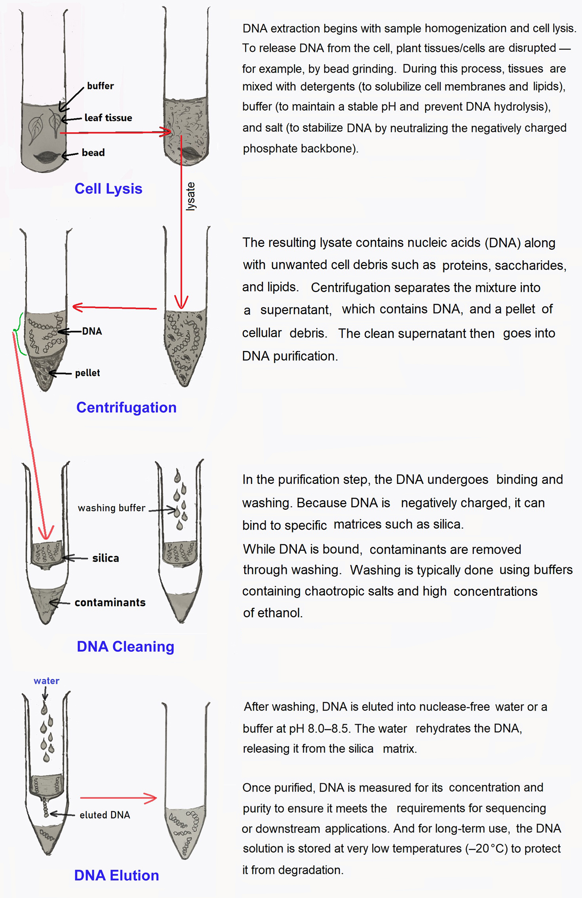
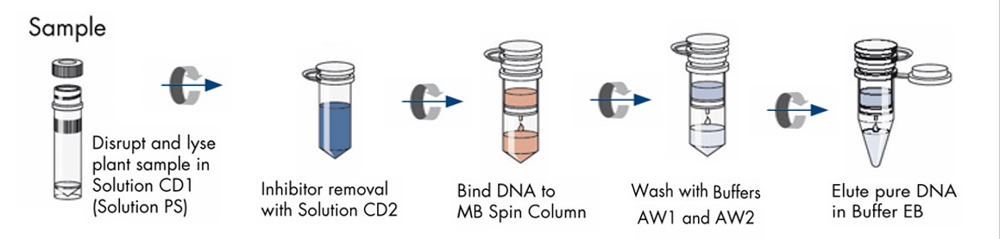

# DNA Extraction Guide

## Table of Contents
- [Basic Principles of DNA Extraction](#basic-principles-of-dna-extraction)
- [Qiagen DNeasy Plant Pro Kit Protocol](#qiagen-dneasy-plant-pro-kit-protocol)
- [Modified CTAB DNA Extraction Protocol](#modified-ctab-dna-extraction-protocol)
  - [Pre-Wash Protocol](#pre-wash-protocol)
  - [CTAB Protocol](#ctab-protocol)
  - [Ethanol Precipitation Protocol](#ethanol-precipitation-protocol)

We are using the **Qiagen DNeasy Plant Pro Kit** and a **modified CTAB protocol** to extract genomic DNA from plant tissues. There is a trade-off between speed and convenience with the Qiagen versus higher yield and lower cost with the CTAB protocol. The Qiagen is quicker and more convenient, allowing extraction of ~24 samples in 3–4 hours, though it is relatively expensive and yielded lower DNA concentrations. By contrast, the CTAB protocol requires substantially more time (~12 hours for 24 samples) but produces much higher DNA yields at lower cost, albeit with greater labor and potential impurities.

## Basic Principles of DNA Extraction

DNA (DeoxyriboNucleic Acid) or RNA (RiboNucleic Acid) extraction process involves disruption of tissue and breaking of the cell wall, cell and nuclear membranes to release the DNA/RNA and then isolating the nucleic acid from the rest of the unwanted cell debris. 

Here is a simple overview of the basic principles and science behind DNA extraction:

DNA extraction is the process of isolating DNA from cells or tissues. In plants, this involves:
1. **Sample homogenization and cell lysis** – breaking the tough plant cell wall (often using grinding with liquid nitrogen or bead beating), and using detergents and buffers to dissolve cell membranes and release DNA into solution (lysis).
2. **Removal of contaminants** – separating DNA from proteins, polysaccharides, and other cellular components (centrifugation).
3. **DNA precipitation/binding and cleaning** – capturing DNA on a solid support (e.g., silica column) or with alcohol precipitation.
4. **Elution** – washing and releasing purified DNA into a clean solution for downstream applications. Then concentration of DNA and purity are measured.
5. **Storage** - Store DNA at **–20 °C** for long-term use or **4 °C** for short-term use.

---
---
---

# [Qiagen DNeasy Plant Pro Kit Protocol](file:///C:/Users/rsbis/AppData/Local/Temp/MicrosoftEdgeDownloads/e9a9b115-43dd-4784-b72e-a6e0c7888c9c/HB-2552-002_HB_DNY_Plant_Pro_0819_WW%20(1).pdf)

 

1. Add ~30 mg of leaf tissue to a bead tube. (*Cut the tissue into small peices before loading into the bead tube. If tissue is tough, grind with a mortar and pestle before transfer*). 
2. Add **450 µl Solution CD1** and **50 µl Solution PS**.  (*For samples rich in polyphenolic compounds, increase PS up to **100 µl** and reduce CD1 accordingly (total solution volume = 500 µl)*).  
3. Incubate at **65 °C for 10 minutes**, then briefly vortex (5 seconds).  
4. Homogenize tissue in the bead mill at **speed 3.1 m/s for 2 minutes**.  
5. Centrifuge at **12,000 × *g* for 2 minutes**.  
6. Transfer the supernatant (*Expect 350–450 µl*) to a 1.5 ml collection tube (*Some plant particles may remain in the supernatant; this is acceptable*)  
7. Add **200 µl Solution CD2** (stored at 4 °C) and vortex for 5 seconds (*For problematic samples, increase CD2 up to **250 µl***)
8. Centrifuge at **12,000 × *g* for 1 minute**.
9. Carefully transfer the supernatant (*Expect 400–500 µl*) to a new 1.5 ml tube, avoiding the pellet.  
10. Add **500 µl Buffer APP** and vortex for 5 seconds.  
11. Load **600 µl lysate** onto an **MB Spin Column** and centrifuge at **12,000 × *g* for 1 minute**.  
12. Discard the flow-through, then **load the remaining lysate** onto the same column.  Centrifuge again at **12,000 × *g* for 1 minute**.  
13. Place the MB Spin Column into a **2 ml collection tube** (*Avoid splashing flow-through onto the column*). 
14. Add **650 µl Buffer AW1** to the MB Spin Column and centrifuge at **12,000 × *g* for 1 minute**.
15. Discard flow-through and place the MB Spin Column back into the same 2 ml collection tube.  
16. Add **650 µl Buffer AW2** to the column. Let sit for **5 minutes**, then centrifuge at **12,000 × *g* for 1 minute**.
17. Discard flow-through and place the MB Spin Column back into the same 2 ml collection tube.  
18. Repeat step 16-17: add another **650 µl Buffer AW2**, let sit for 5 minutes, then centrifuge at **12,000 × *g* for 1 minute**, discard flow-through and place the column back into the same 2 ml collection tube.  
19. Now, **centrifuge** the MB Spin column at **13,300 × *g* for 2 minutes** to dry the white filter membrane in the MB Spin Column.  
20. Place the MB Spin Column into a new clean 1.5 ml elution (collection) tube.  
21. Add **50 µl Buffer EB** (10mM Tris) directly to the center of the white filter membrane.  
22. Centrifuge at **12,000 × *g* for 1 minute** to elute DNA.  
23. Discard the MB Spin column. The eluted DNA is now in the 1.5 ml collection tube.  
24. Measure DNA concentration and purity (e.g., Nanodrop spectrophotometer (*better for absorption*) or Qubit fluorometer (*more precise for concentration*).  
25. Store DNA at **-80 to –20 °C** for long-term use (4 °C is OK for short-term use).

---
---
---

# Modified CTAB DNA Extraction Protocol

:point_right: Reference: [Doyle and Doyle 1987](https://webpages.charlotte.edu/~jweller2/pages/BINF8350f2011/BINF8350_Readings/Doyle_plantDNAextractCTAB_1987.pdf), and [Cullings 1992](https://doi.org/10.1111/j.1365-294X.1992.tb00182.x), With modifications by Jeremy Johnson

**Purpose:** Cost-effective method for extracting DNA from plants with high polysaccharide content.
 

### Reagents / Solutions and their functions

:small_blue_diamond: **CTAB (Cetyl Triethyl Ammonium Bromide)**: *Cationic detergent, disrupts cell membranes, binds and removes polysaccharides (cellulose) and secondary metabolites.*

:small_blue_diamond: **1 mM Tris HCl** :- *Maintains a stable pH.*

:small_blue_diamond: 0.5 M **EDTA (EthyleneDiamineTetraacetic Acid)**: *Chelating agent. Binds metal cations like Mg++ Ca++ that can inactivate enzymes (like nucleases: DNase, RNase) and thus protects DNA from degradation.*

:small_blue_diamond: 5M **NaCl**: *Helps remove protein bound to the DNA. Na+ binds with negative phosphate of DNA and precipitate*. 
>> Heikrujam et al. 2020: If cells are in hypotonic solution, cells may burst… If in hypertonic solution, water oozes out from the cell, and cells shrink and crumple. 0.5 M provides ionic strength needed for CTAB to precipitate polysaccharides. In protocols developed for getting rid of polysaccharides, higher concentration has been recommended.

:small_blue_diamond: **PVP (PolyVinylPyrrolidone)**: *Absorbs polyphenols (by hydrogen bonding).*

:small_blue_diamond: **β-mercaptoethanol (2-mercaptoethanol)**: *reducing agent, removes phenolic compounds tannins and polyphenols*

:small_blue_diamond: **Chloroform : Isoamyl Alcohol (24:1)**: ***Chloroform** denatures proteins and lipids and help separating proteins from aqueous DNA phase. **Isoamyl alcohol** reduces foaming improming the phase separation.*

:small_blue_diamond: **Ammonium Acetate** (ice cold): *Helps nutralizing negative charges of phosphate backbone of DNA and precipitates contaminants (proteins, polysaccharides).*

:small_blue_diamond: **Isopropanol** (ice cold): *precipitates DNA.*

:small_blue_diamond: **70% and 99% Ethanol (EtOH)** (ice cold): *washes DNA pellet.*

---
---

Prepare **Washing Buffer** (Tris Hcl, EDTA, NACL, H2O) and **CTAB Buffer** (Tris Hcl, EDTA, NaCl, H2O, CTAB), and 1x **TE Buffer** (to resuspend DNA at the end).   

#### <ins>Washing Buffer:<ins>

We need **1 mL Washing buffer per sample**. Prepare **X mL** (more than N mL) of washing buffer for N number of samples (rxn) with appropirate proportion of reagents, following the table below;

<table>
  <thead>
    <tr>
      <th rowspan="2">Solutions</th>
      <th colspan="5">Volume of Stock Solution to be Prepared</th>
    </tr>
    <tr>
      <th>X mL</th>
      <th>1000 mL</th>
      <th>100 mL</th>
      <th>50 mL</th>
      <th>25 mL</th>
      <th>10 mL</th>
      <th>5 mL</th>      
    </tr>
  </thead>
  <tbody>
    <tr>
      <td>Tris HCl (1M)</td>
      <td>0.1*X mL</td>
      <td>100 mL</td>
      <td>10 mL</td>
      <td>5 mL</td>
      <td>2.5 mL</td>
      <td>1 mL</td>
      <td>0.5 mL</td>
    </tr>
    <tr>
      <td>EDTA (0.5M)</td>
      <td>0.1*X mL</td>
      <td>100 mL</td>
      <td>10 mL</td>
      <td>5 mL</td>
      <td>2.5 mL</td>
      <td>1 mL</td>
      <td>0.5 mL</td>
    </tr>
    <tr>
      <td>NaCl (5M)</td>
      <td>0.2*X mL</td>
      <td>200 mL</td>
      <td>20 mL</td>
      <td>10 mL</td>
      <td>5 mL</td>
      <td>2 mL</td>
      <td>1 mL</td>
    </tr>
    <tr>
      <td>H₂O</td>
      <td>0.6*X mL</td>
      <td>600 mL</td>
      <td>60 mL</td>
      <td>30 mL</td>
      <td>15 mL</td>
      <td>6 mL</td>
      <td>3 mL</td>
    </tr>
  </tbody>
</table>

---

#### <ins>CTAB Extraction Buffer:<ins>

We need **0.5 mL CTAB buffer per sample**. Prepare **X mL** (more than (N/2) mL) of CTAB buffer for N rxn with the proportion of reagents as shown in the following table;

<table>
  <thead>
    <tr>
      <th rowspan="2">Solutions</th>
      <th colspan="6">Volume of Stock Solution to be Prepared</th>
    </tr>
    <tr>
      <th>X mL</th>
      <th>1000 mL</th>
      <th>100 mL</th>
      <th>50 mL</th>
      <th>25 mL</th>  
      <th>12 mL</th>
      <th>10 mL</th>  
      <th>5 mL</th>       
    </tr>
  </thead>
  <tbody>
    <tr>
      <td>Tris HCl (1M)</td>
      <td>0.1*X mL</td>
      <td>100 mL</td>
      <td>10 mL</td>
      <td>5 mL</td>
      <td>2.5 mL</td>
      <td>1.25 mL</td>
      <td>1 mL</td>
      <td>0.5 mL</td>
    </tr>
    <tr>
      <td>EDTA (0.5M)</td>
      <td>0.04*X mL</td>
      <td>40 mL</td>
      <td>4 mL</td>
      <td>2 mL</td>
      <td>1 mL</td>
      <td>0.5 mL</td>
      <td>0.4 mL</td>
      <td>0.2 mL</td>
    </tr>
    <tr>
      <td>NaCl (5M)</td>
      <td>0.28*X mL</td>
      <td>280 mL</td>
      <td>28 mL</td>
      <td>14 mL</td>
      <td>7 mL</td>
      <td>3.5 mL</td>
      <td>2.8 mL</td>
      <td>1.4 mL</td>
    </tr>
    <tr>
      <td>CTAB</td>
      <td>X/50 g</td>
      <td>20 g</td>
      <td>2 g</td>
      <td>1 g</td>
      <td>0.5 g</td>
      <td>0.25 g</td>
      <td>0.2 g</td>
      <td>0.1 g</td>
    </tr>
    <tr>
      <td>H₂O</td>
      <td>0.58*X mL</td>
      <td>580 mL</td>
      <td>58 mL</td>
      <td>29 mL</td>
      <td>14.5 mL</td>
      <td>7.25 mL</td>
      <td>5.8 mL</td>
      <td>2.9 mL</td>
    </tr>
  </tbody>
</table>

---

#### <ins>TE Buffer:<ins>

We need **100 µL** of **1x TE buffer** (around 8.0 pH) per sample (rxn) to resuspend DNA at the end. Prepare **X mL** (more than (100xN) µL) of TE buffer needed for samples.

| Solutions                | X mL for N rxn      | 100 mL for 1000 rxn | 10 mL for 100 rxn | 5 mL for 50 rxn   |
|--------------------------|---------------------|---------------------|-------------------|-------------------|
|         Tris-EDTA (100x) |   X/100 mL          |   1 mL              |   0.1 mL          |   0.05 mL         |
|         H₂O              |   99X/100 mL        |   99 mL             |   9.9 mL          |   4.95 mL         |
 

 

---

### <b>Autoclave all buffers!</b>

---

 

## Extraction begins:

***Prep*:** After pre-wash, the regular extraction procedure continues immediately. **CTAB buffer needs to be at 65°C** temperature. **Ammonium acetate, Isopropanol, 70% and 99% Ethanol all need to be cold (4°C)**. Therefore,  
- *Preheat the heat thermos-mixer to 65°C, and incubate the CTAB buffer.*  
- *Put Ammonium acetate, Isopropanol, 70% and 99% Ethanol in refrigerator (-20°C).*

---

### Pre-Wash Protocol

1.  Measure out washing buffer stock (1 mL per reaction) plus about 10% overage.
  *i.e. (N + 0.1xN= 11N/10) mL. eg. for **24 samples**, 24 + 2.4 = **26.4 mL**)*
2.	Stuff bead mill tubes with foliage sample as needed.
*(~30 mg for pine, spruce species), being careful to not cross contaminate samples. If using hands to stuff tubes (break the long needles!), change gloves for each sample. (If tissue is tough, grind with a mortar and pestle before transfer)*
3.	Add 1 mL Washing buffer, then 0.01 g PVP, and 4.5 µL β-mercaptoethanol in each tube.
*Strategy for this can be like: Adding **0.01 x (11N/10)** g of **PVP** (eg. 0.264 g for 24 rxn), then **4.5 x (11N/10)** µL (eg. 118.8 µL for 24 rxn) of **β-ME** (in fumehood) to the measured 11N/10 mL washing buffer stock. Then add **1004.5 µL** of the mix to each bead mill tube*.  
    ⚠️ **R.B :point_right:**  
    • One 5.6 mm Bead doesn't grind conifer leaf needles (*White spruce, Red pine, Jack pine*) well when all washing buffer mix is in the tube.  
    • Using an extra bead risks breaking the tube. 
    • Zirconium beads (1.5 mm) worsens the tissue disruption condition. 
  	• Stainless steel beads (2 mm) doesn't grind well (5 beads or 10 beads, doesn't improve). 
  	• In presence of one 5.6 mm bead, five 2 mm steel beads disrupt tissue even when all the washing buffer is there in the tube. 
    :point_right: **A Better approach:** Add **500 µL** of the washing buffer  →	 bead mill **grind** (steps 4-5)  →	 add remaining **504.5 µL** of the wash buffer  →	 **vortex** →	proceed to steps 6–9.  
>> *Instead of using bead mill tissue disruption, we can also grind the plant material using liquid nitrogen and clean sterile Micropestle. Add the ground tissue in a tube. Then 1 ml of washing buffer is added to tube. Shake vigorously to mix (use pipette tip to mix in order to guarantee complete mixing)*
4. Insert bead mill tubes into bead mill, making sure that the tubes are in a balanced arrangement.
5. Run bead mill for 2 minutes at 3.55 m/s.
6. Transfer bead mill tubes to centrifuge, making sure that the tubes are in a balanced arrangement.
7. Spin tubes in centrifuge for 10 min at >10,000 rpm.
8. Pipette off supernatant and keep the pellet.
9. Proceed with regular extraction protocol immediately.

---
---

### CTAB Protocol

1.  Measure out the autoclaved **CTAB buffer stock** (0.5 mL/rxn plus 10% overage) *i.e. 11N/20 mL. (eg. **13.2 mL for 24 samples**)*
2.	Add 0.02g PVP and 2.5 µL β-mercaptoethanol for each reaction.  *To the measured 11N/20 mL CTAB buffer stock, add **0.02 x 11N/10** g (eg. 0.528 g for 24 samples) **PVP**, then **2.5 x 11N/10** µL (eg. 66 µL for 24 samples) **β-ME**. Then, add **502.5 µL** (500 + 2.5) of the buffer mix (CTAB buffer stock + PVP + β-ME mix) to each tube.*
3.	Mix vigorously (vortex for 10 seconds).
4.	**Incubate** samples at 65°C using the Eppendorf thermos mixer for **3 hours**.
5.	Using **filter tip**, add **500 µL** of 24:1 **Chloroform: Isoamyl Alcohol** and mix well by vortexing.
6.	**Centrifuge for 5-10 min** at maximum speed (13,300 rpm).  
-	Following centrifugation, you should have 3 layers: **aqueous phase** (top), **debris and proteins** (middle), and **chloroform** (bottom). (*Chloroform: nonpolar hydrophobic solvent in which nonpolar proteins and lipids get dissolved, leaving isolated DNA protected in the aqueous phase*.  
-	Go onto next step quickly so the phases do not remix.

7.	Pipette slowly off aqueous phase (don't suck up any of the middle proteins debris and bottom chloroform phases.
8.	Place the aqueous phase into a **new labeled Eppendorf tube**.
9.	Repeat steps 5-6: **Add 500 µL Chloroform: Isoamyl Alcohol** to the aqueous phase in the Eppendorf tube, **vortex** the tube, and **centrifuge for 5-10 minutes** at maximum speed. 
10.	Pipette off **300 µL aqueous phase** (Do not suck up the protein or chloroform phase. (*Pay particular attention to the slight protein layer at this point. Your should have more than 300 µL aqueous phase. Pipetting less volume of aqueous phase helps avoiding other phases, which will improve quality of DNA.)
11.	Place the **300 µL aqueous phase** into a **new labeled Eppendorf tube**.
12.	Add 0.08 volumes (300 × 0.08 = ~**24 µL**) of cold 7.5 M **ammonium acetate** to each Eppendorf tube.
13.	Add 0.54 volume (300 × 0.54 = ~**162 µL**) of cold **isopropanol (2-propanal)** (*cold isopropanol precipitates DNA*) to each tube.
14.	Mix well and **incubate in -20°C freezer for 1 hour** (Longer times will yield more DNA, but also more contaminants).
15.	**Centrifuge** for 3 min at maximum speed.
16.	Pour off (pipette off) the liquid. Do not lose the DNA pellet.
17.	Add **700 µL** of cold **70% EtOH**, **mix well**, and	**Centrifuge for 1 min** at maximum speed.
18.	Pour or pipette off the liquid, Do not lose the DNA pellet.
19.	Add **700 uL** of cold **99% EtOH**, **mix well**, and **Centrifuge for 1 min** at maximum speed.
20.	Pour or pipette off the liquid, do not lose the DNA pellet. (*Pipetting off is better option to air-dry the pellet*)
21. Allow pellets to dry (with Eppendorf tube cap open) in fumehood for 1-2 hours.  
>> If SpeedVac is available, dry the pellet for 30 min in the SpeedVac (*a) Turn on the rotor first and wait for the vacuum to start → b) Set the temperature to 30°C → c)	Turn on the motor second and start suction → d) Reverse steps to stop*)

22.	**Resuspend** samples with **100 µL** of **1x TE buffer**. Allow to resuspend for 1 hr at 55°C or overnight in refrigerator before measuring purity, concentration or running a test gel.
23.	If DNA is not of good quality, not clear resuspended solution, smearing in gel electrophoresis, etc), Clean DNA using an **Ethanol precipitation protocol** (below) if needed.

---

### Ethanol Precipitation Protocol

1.	The volume of the DNA is less than **200 μl** (resuspended in 100 µl TE buffer), bring the volume up to 200 μl with sterile dH2O (adding 100 μl).
2.	Add **1/10th** volume of **3M sodium acetate** to the DNA solution and mix. (i.e. add **20 μL** to the **200μL** solution)
3.	Add **2** volumes (i.e. **400 μL**) of **absolute EtOH at -20°C** and vortex for **10** seconds.
4.	Put the tube in a **-20°C freezer overnight** or a **-70°C freezer for 20 minutes**.
5.	**Centrifuge** the tube for **5 minutes** at maximum speed (DNA pellet precipitates on the tube bottom).
6.	Invert the tube with the lid closed and look for the pellet. While upside down, **pour out the liquid** but **save the pellet**.
7.	**Wash the pellet** with **500 μl of 4°C 70% EtOH**, gently roll the tube, then dump the liquid.
8.	SpeedVac or air-dry **the pellet**.
9.	**Resuspend DNA** in appropriate volume of TE buffer or nuclease free water. (100 μL as before)

